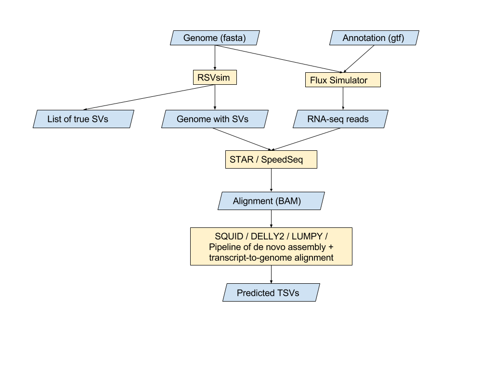
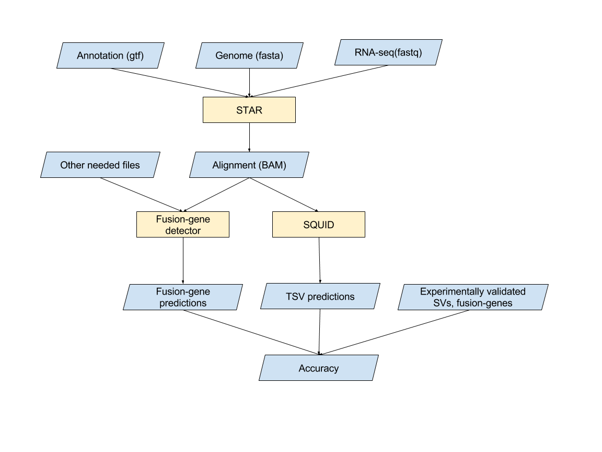
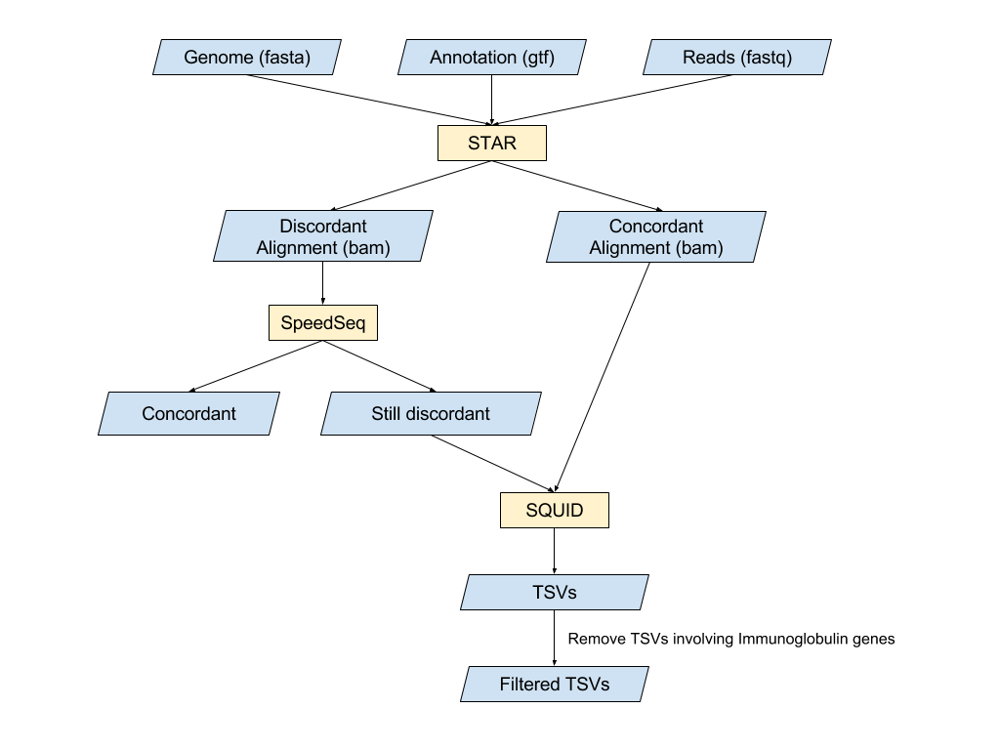

# OVERVIEW
This repository keeps the scripts and links to the data used to generate the results in SQUID manuscripts. There are 3 sections of results: on simulation data, on previously studied cell lines, on TCGA data. SQUID software is available at [https://github.com/Kingsford-Group/squid](https://github.com/Kingsford-Group/squid).

# ON SIMULATION DATA
### Software Used
Required:
- SQUID
- [samtools](https://github.com/samtools/samtools)
- [STAR](https://github.com/alexdobin/STAR)
- [SpeedSeq](https://github.com/hall-lab/speedseq)
- [DELLY2](https://github.com/dellytools/delly)
- [LUMPY](https://github.com/arq5x/lumpy-sv)
- [Trinity](https://github.com/trinityrnaseq/trinityrnaseq)
- [Trans-ABySS](https://github.com/bcgsc/transabyss)
- [MUMMER3](https://github.com/marbl/MUMmer3)
- [Gmap](https://github.com/juliangehring/GMAP-GSNAP)

Optional (you will need them for simulating RNA-seq reads and SVs):
- [RSVsim](https://bioconductor.org/packages/release/bioc/html/RSVSim.html)
- [Flux Simulator](http://sammeth.net/confluence/display/SIM/Home)

The script build_simulation.sh will automatically download and install the above software.
```
./build_simulation.sh
```

Be sure to add these software into your path by running
```
export PATH=$(pwd)/tools/bin:${PATH}
```

### Workflow Description


### Re-producing the Result
- To skip the simulating step, download the simulated data simulation_data00 and simulation_data01 from [here](https://cmu.box.com/s/e9u6alp73rfdhfve2a51p6v391vweodq). Decompress them by running the following command in terminal.
```
cat simulation_data00 simulation_data01 > simulation_data.tar.gz
tar -xzvf simulation_data.tar.gz
```
To move on with the workflow, we provide a script to do alignment and TSV calling. You can generate all results by running
```
./scripts/runSimulationData.sh <decompressed data folder> <number of threads>
```

- If you want to simulate your own data, make sure the optional software are in your path. We write a script to run simulation as in the manuscript. Simply run the following command. (The whole simulation may take more than 1 day to finish, be patient ^ ^)
```
./scripts/runWholeSimulation.sh
```

Find the specification of output directory and files [here](doc/outputspec_simulation.md)

# ON PREVIOUSLY STUDIED CELL LINES
### Data Used
Here we use Ensembl genome 75 with corresponding annotation file as reference genome for alignment and TSV detection. 

For RNA-seq, we use publicly available dataset in SRA database. We merge SRR2532344 and SRR925710 for RNA-seq data of HCC1954 cell line, and use SRR2532336 for HCC1395 cell line.

Running the following command to download genome data and RNA-seq data for you. Make sure fastq-dump (from SRA Toolkit) is in your path.
```
./scripts/downloadHCC.sh <output directory>
```

### Software Used
- SQUID
- [samtools](https://github.com/samtools/samtools)
- [SRA Toolkit](https://trace.ncbi.nlm.nih.gov/Traces/sra/sra.cgi?view=software)
- [Picard Tools](https://broadinstitute.github.io/picard/)
- [Chimerascan](https://code.google.com/archive/p/chimerascan/)
- [deFuse](https://bitbucket.org/dranew/defuse)
- [FusionCatcher](https://github.com/ndaniel/fusioncatcher)
- [INTEGRATE](https://sourceforge.net/projects/integrate-fusion/)
- [JAFFA](https://github.com/Oshlack/JAFFA)

We don't provide scripts for automatic installation of the above tools. Please follow the instruction for each tools for installation and reference preparation. 
For preparing reference data for each fusion-gene detection tool, we use the following setting in manuscript:
- Chimerascan: We use downloaded Ensembl genome 75 dna sequence. But gtf format is not supported in Chimerascan, so we provide the processed annotation in [dataHCC.tgz](https://cmu.box.com/s/jfigzai5chin9gz2ujlgrfs0nfqqntjt). After decompression, the annotation file for Chimerascan is named as Homo_sapiens.GRCh37.75_chimerascan.txt.
- deFuse: Specify in their config.txt file that ensembl_version is 75, ensembl_genome_version is GRCg37, and ucsc_genome_version is hg19.
- FusionCatcher: Don't need to anything special. The output comes with predictions in GRCh37 coordinate.
- INTEGRATE: We provide the annotation file in [dataHCC.tgz](https://cmu.box.com/s/jfigzai5chin9gz2ujlgrfs0nfqqntjt) for constructing genome index for INTEGRATE. The file is named as annot.ensembl.txt.
- JAFFA: We download and decompress reference file [JAFFA_REFERENCE_FILES_HG19_GENCODE19.tar.gz](https://github.com/Oshlack/JAFFA/wiki/Download)

### Workflow Description


### Re-producing the Result
Running the following command to reproduce the result:
```
./scripts/runHCC.sh 
```

# ON TCGA DATA
### Software Used
- SQUID
- [samtools](https://github.com/samtools/samtools)
- [pysam](http://pysam.readthedocs.io/en/latest/)
- [STAR](https://github.com/alexdobin/STAR)
- [SpeedSeq](https://github.com/hall-lab/speedseq)

### Workflow Description


### Re-producing the Result
We use Ensembl genome 85 and corresponding gene annotation for alignment. To download the genome and prepare STAR index, run the following command:
```
./scripts/downloadTCGA_genome.sh <number threads> <output directory>
```
The downloaded reference file will have the following structure in output directory:
- Homo_sapiens.GRCh38.dna_sm.primary_assembly.fa: genome sequence file
- Homo_sapiens.GRCh38.87.gtf: gene annotation file
- StarIndex: folder for STAR index

The barcodes of TCGA samples we used are located in [dataTCGA.tgz](https://cmu.box.com/s/ahg15ewlj03tmjd14pk27jpwmntxh68r). After getting RNA-seq fastq files (read1 and read2 in separate files), and make sure STAR and SpeedSeq executable are in your path, running the following command to execute the workflow:
```
./scripts/TCGAcommand.sh -p <number threads> -r1 <read1 fastq> -r2 <read2 fastq> -i <StarIndex folder> -g <gtf file> -o <output folder>
```